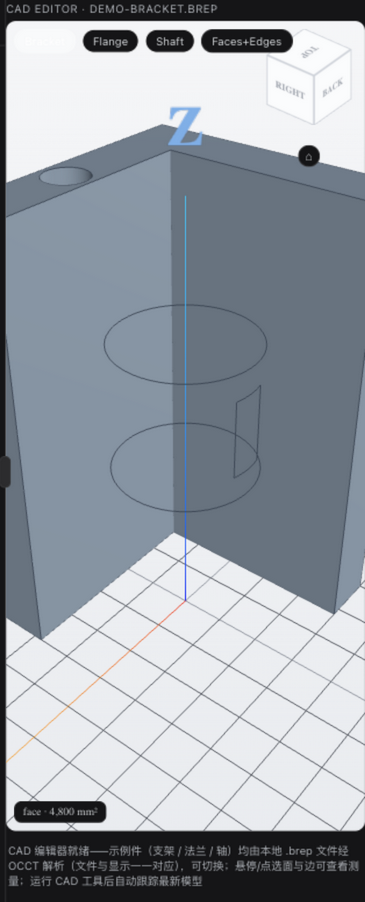

# dsh-cad — CAD Plugin for DeepSeek Harness


[](https://lau-mars.github.io/dsh-cad/)
[](https://github.com/deepseek-ai/deepseek-harness)
[](https://nodejs.org/)
[](https://github.com/donalffons/opencascade.js)
[](./LICENSE)

[English](./README.md) | 简体中文

[DeepSeek Harness (dsh)](https://github.com/deepseek-ai/deepseek-harness) 的 CAD 插件：
在 Web UI 中提供**内嵌 3D/2D CAD 查看器**与**原生参数化建模工具族**（OCCT 内核），
让 agent 能够"边建边看"地完成 CAD 工作。

## 预览

启动即见的 CAD 编辑器：示例 L 型支架由内置的 `demo-bracket.brep` 经 OCCT
解析渲染——面 + 边显示模式、悬停即测（拾取面 4,800 mm²）、角落 ViewCube
导航块、支架 / 法兰 / 轴三种示例件一键切换：



## 功能总览

| 能力 | 说明 |
| --- | --- |
| 🔍 CAD 查看 | STL / OBJ / STEP / IGES / BREP / DCPRT（3D），DXF / SVG（2D），对话内嵌交互卡片（轨道旋转 / 缩放 / 线框 / 平移） |
| 🧭 CAD 编辑器交互 | Onshape 风格 ViewCube（26 区域点击定向）、悬停/点选面与边实时测量（面积 mm² / 长度 mm）、面+边 / 面 / 线框三种渲染模式、支架 / 法兰 / 轴 BRep 示例件一键切换 |
| 🏗️ 参数化建模 | 基本体（box/cylinder/sphere/cone/torus）、轮廓拉伸、布尔（fuse/cut/common）、全边圆角、变换（平移/旋转/镜像）—— OCCT 精确 BRep，非网格近似 |
| 📐 几何测量 | 精确体积（mm³）、包围盒、三角统计、DXF 图层 |
| 📤 按需导出 | STEP（参数化）/ STL（网格），仅在用户要求时写文件 |
| 🖥️ 常驻 3D 显示区 | 会话页签栏常驻 "3D" 页签：无模型时显示 XYZ 坐标轴 + 网格（Z-up），建模时**实时跟踪最新模型** |
| ⚡ 直通渲染管道 | worker 网格 → 内存二进制 → three.js typed-array，零 base64 / 零中间文件 / 零每步落盘 |
| 💾 建模文档持久化 | 操作日志（JSON）+ 防抖磁盘镜像，进程重启后自动重放恢复 |
| 🖼️ 图片 → 轮廓 | PNG 草图/截图 → Otsu 二值化 → 轮廓追踪 → 可直接拉伸的多边形（`cad_image_profile`） |
| 🔌 FreeCAD 执行器 | 在外部 FreeCAD 控制台运行同一 op 族（STEP 输入/输出闭环）；需本地安装 |

## 安装（开发模式）

```sh
git clone https://github.com/LAU-MARS/dsh-cad.git
cd dsh-cad
npm install && npm run build && npm test

npm install -g @deepseek-ai/dsh pnpm   # 需要 Node ≥ 22
dsh web                                  # 首次启动初始化 profile 后 Ctrl-C

dsh plugin --profile web add /path/to/dsh-cad

# ~/.dsh/profiles/web/cordis.patch.yml 追加：
#   - insert:
#       - id: dsh-cad
#         name: 'dsh-cad'

dsh web
```

设置 `DEEPSEEK_API_KEY` 后对话即可使用，例如：

- “打开 bracket.stl 看看” → `cad_view`
- “画一个 100×60×5 的板，中间打 ⌀20 孔，四角 R2 圆角，加 ⌀16 高 20 凸台，导出 plate.step”
  → `cad_create_prim` + `cad_boolean` + `cad_fillet` + `cad_export`，每步 3D 页签实时更新
- “堆一个雪人” → 球体 + 圆锥鼻子 + 圆柱帽子（`at`/`axis` 精确定位）

## 模型工具族

| 工具 | 说明 |
| --- | --- |
| `cad_view` | 打开 CAD 文件，渲染交互式查看器卡片 |
| `cad_info` | 只读几何元信息（格式/数量/包围盒/单位/图层） |
| `cad_create_prim` | 基本体（mm，Z-up），`at` 定位、`axis` 定向（精确轴角旋转） |
| `cad_extrude_profile` | XY 平面闭合多边形沿 +Z 拉伸成实体 |
| `cad_boolean` | fuse / cut / common（经典打孔：plate cut cylinder） |
| `cad_fillet` | 全锐边等半径圆角 |
| `cad_transform` | 平移 / 欧拉旋转 / 镜像 |
| `cad_volume` | 精确 BRep 体积（mm³） |
| `cad_export` | 导出 STEP / STL / DCPRT（原生可重放零件文档）到工作区路径 |
| `cad_delete` | 删除 body |
| `cad_freecad` | 在外部 FreeCAD 执行器上运行 op 程序（可选 STEP 输入/导出） |
| `cad_image_profile` | PNG → 轮廓 → 可直接拉伸的多边形点集 |

每步建模后：**同一查看器卡片原地刷新**（稳定 viewId + 版本化 URL），
"3D" 页签实时跟踪最新模型。

## 连接器（规划中）

建模目前已由**内置的 WebGL 级建模器**承担（浏览器内的 OCCT 内核，零安装）；
下表连接器指未来以**外部 CAD 引擎作为执行器**驱动同一工具族：

| 连接器 | 套件 | 状态 |
| --- | --- | --- |
| **内置内核** | 基于 OCCT + WebGL 的 CAD 建模内核，浏览器内运行——零安装 | ✅ 内置 |
| FreeCAD | 开源参数化套件——可经其 Python API 作为本地执行器 | ✅ 可用（需本地安装） |
| SolidWorks | 达索系统的主流 3D CAD | 🚧 规划中 |
| Fusion 360 | Autodesk 云端 CAD/CAM | 🚧 规划中 |
| Onshape | 云原生 SaaS CAD，完全在浏览器中 | 🚧 规划中 |
| 中望3D（ZW3D） | 中望软件的一体化 CAD/CAM | 🚧 规划中 |
| 浩辰3D | 浩辰软件的 3D CAD | 🚧 规划中 |

## 架构

```
cad_view(path)                        建模工具（cad_create_prim 等）
  → 导入 worker（occt-import-js）       → 建模 worker（opencascade.js WASM）
  → CadScene JSON（base64-f32）         → BRep 精确几何 + 网格化
  → GET /dsh-cad/scene/<id>            → 内存二进制场景（f32/u32 打包）
                                        → GET /dsh-cad/bin/<docId>
            ↓ 会话 presentationMeta（viewId + 版本化 URL）↓
        浏览器卡片 + 常驻 "3D" 页签（three.js / SVG，Z-up，XYZ 轴）
```

- **两个 worker**：导入（occt-import-js，只读 STEP/IGES/BREP）与建模（opencascade.js 1.1.1，
  完整 OCCT）分离，均惰性启动；embind 重载构造器的 `_N` 后缀约定封装在
  `src/modeling/occt-adapter.cjs`（全部经运行时实证）
- **直通管道**：建模场景零 base64 / 零 JSON 大数组 / 零每步落盘（磁盘镜像 1.5s 防抖，
  仅服务重启回放）；`cad_export` 是唯一的显式文件导出
- **建模文档**：`<workspace>/.dsh-cad/model.json` 操作日志，重启后重放恢复全部 body
- **客户端**：esbuild 单文件 CJS 工厂（three.js 内联 ~560KB，react 由宿主模块表提供），
  Z-up CAD 惯例，带 XYZ 轴标签与地面网格的空场景常驻显示

## 测试

```sh
npm test                             # 41 项：转换器 / 建模 worker（体积精确断言）/ DCPRT 往返 / FreeCAD 执行器 / 图片轮廓 / 二进制管道 / 文档持久化
node test/m0-kernel-check.cjs        # OCCT 内核 API 冒烟
node test/route-check.mjs            # JSON 场景路由层
node test/visual/serve.mjs           # 浏览器卡片/页签视觉验证页（http://127.0.0.1:3987）
```

覆盖的代表性断言：布尔打孔体积精确等于解析值（28429.20 mm³）、L 型轮廓拉伸
3000 mm³、球/锥/环带 `at`/`axis` 定位的体积与包围盒翻转、二进制打包 8 字节对齐、
STL 导出往返（导出 → 一期解析器读回），以及 DCPRT 文档往返
（序列化 → OCCT worker 重放 → 精确包围盒）。

## 已知限制

- DWG（闭源）不支持；DXF bulge 弧以弦线近似；glTF/3MF 查看未实现（结构已预留）
- `cad_fillet` 为全边等半径（embind 下按边选择不稳定）；chamfer 未实现
- 草图拉伸仅支持多边形轮廓（圆弧轮廓用布尔组合圆柱/圆环构造）
- dsh 框架限制：已挂载的 single 槽（右侧 details 面板本体）不响应后注册组件，
  故常驻显示区以 "3D" 视图页签提供（list 槽，官方组合方式）
- 宿主读取 CAD 文件使用 node:fs（平台 fs 服务仅支持 UTF-8 文本，无法承载二进制）

## 贡献者

由提交历史自动生成，感谢每一位贡献者！

[](https://github.com/LAU-MARS/dsh-cad/graphs/contributors)

## License

MIT
